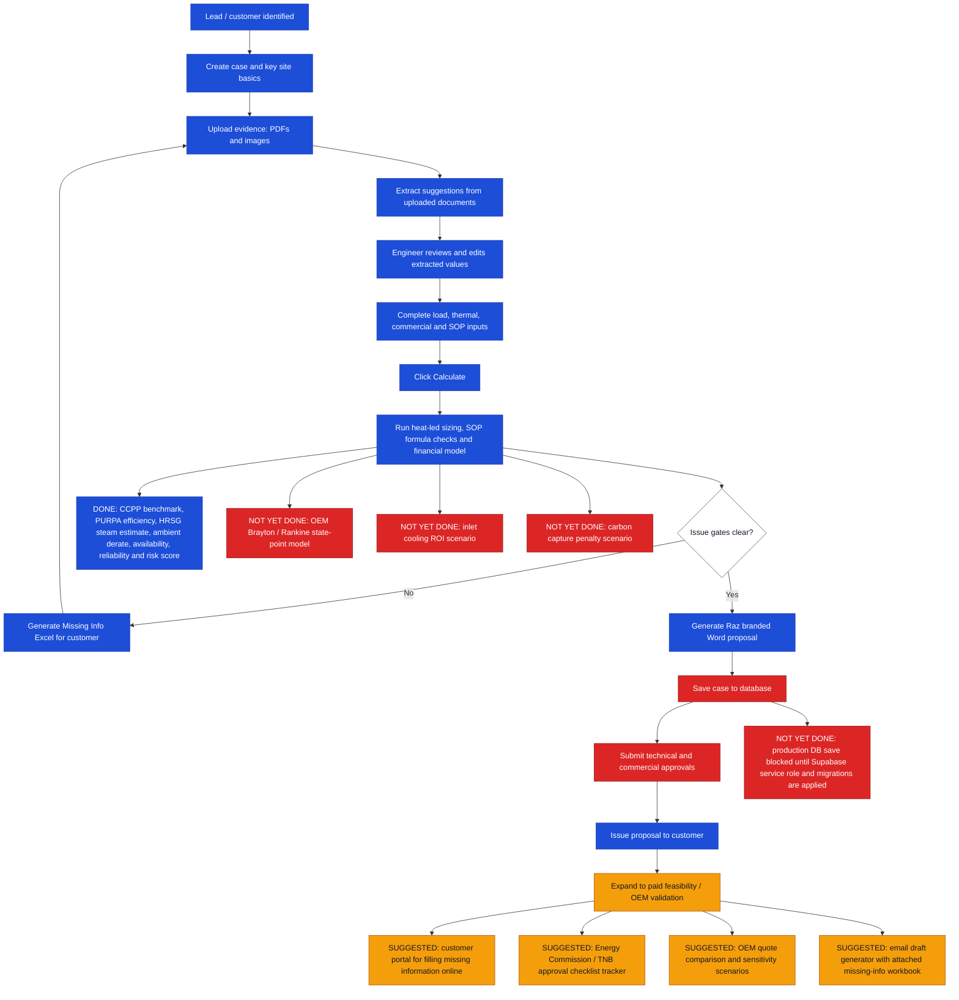

# User Journey Snapshot

## Snapshot Notes

- Blue boxes are working application capabilities.
- Red boxes are not complete or blocked.
- Amber boxes are recommended journey expansions.
- `Save case to database` exists in the app, but production persistence is not complete until Supabase service-role credentials and migrations are applied.
